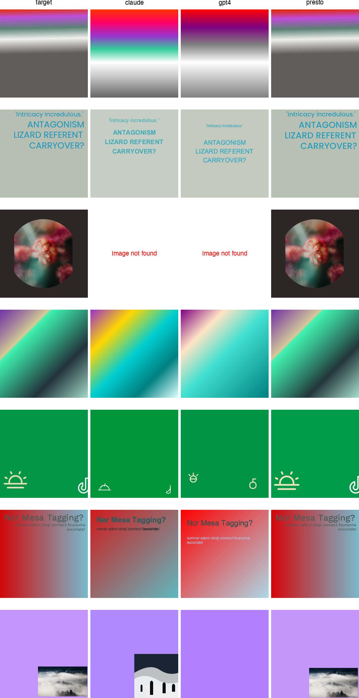

# SVG Generation Benchmark Suite

This benchmark suite, created by [Presto Design](https://github.com/Presto-design), evaluates large language models on their ability to generate SVG code from visual designs. It's part of our mission to advance the field of machine-assisted graphic design.

## Why This Benchmark Matters

### The Importance of LLMs in Graphic Design
Large Language Models (LLMs) are becoming vital tools for professional graphic design, offering advantages that image generation models like Stable Diffusion cannot match:
- Ability to work with branded assets and specific stock photos
- Support for brand fonts and typography
- Creation of scalable, resolution-independent designs
- Direct manipulation of design elements through code

### The Current State of LLM Graphic Design
LLMs have historically struggled with graphic design tasks. This benchmark focuses on testing their "fifth grader" abilities - given an image, can they replicate it perfectly? This fundamental capability is a necessary stepping stone toward more sophisticated design tasks.

### About the Benchmark Dataset
The [benchmark dataset](https://huggingface.co/datasets/Presto-Design/svg_basic_benchmark_v0) contains 2,000 images and their associated SVG code, testing comprehension of key SVG features:
- Colors and gradients
- Basic and complex shapes
- Image handling and masks
- Text and font manipulation
- Icons and strokes
- Advanced SVG features

For more insights, read our article: ["Why LLMs are Bad at Creating SVGs and Graphic Design - And How to Make Them Good"](https://davidmack.medium.com/why-graphic-design-is-hard-for-large-language-models-64ee67c4309c)

### About Presto's Vectorizer model

You can freely try our vectorizing model here: https://huggingface.co/Presto-Design/llm_adapter_vectorizer_qwen7b

It takes images and will output SVGs, with alt text on images suggesting a stock photography search.

## Contributing

We welcome contributions to improve the benchmark! Here's how you can help:

1. **Run the Benchmark**: Test new models and share your results
2. **Improve the Code**: Submit PRs to enhance the benchmark suite
3. **Add Test Cases**: Help expand the test dataset
4. **Share Findings**: Publish your insights and improvements

For contribution guidelines, check our [GitHub repository](https://github.com/Presto-design/svg-benchmark).

## Setup

1. Make sure you have Python 3.9+ installed
2. Install dependencies using Poetry:
```bash
poetry install
```

3. Set up your environment variables:
```bash
cp .env.template .env
```
Then edit `.env` and add your API keys:
- `ANTHROPIC_API_KEY`: Your Anthropic API key for Claude (only needed if using Claude)
- `OPENAI_API_KEY`: Your OpenAI API key for GPT-4 (only needed if using GPT-4)

## Running the Benchmark

The benchmark is split into two parts: generation and scoring.

### Generation

The generation script runs the selected models and generates SVGs:

```bash
# Run with Claude only
poetry run python -m svg_benchmark.generate --use-claude

# Run with GPT-4 only
poetry run python -m svg_benchmark.generate --use-gpt4

# Run with Presto model
poetry run python -m svg_benchmark.generate --use-presto

# Run with multiple models
poetry run python -m svg_benchmark.generate --use-claude --use-gpt4 --use-presto

# Additional options:
--parallel N     # Number of parallel processes per model (default: 8)
--dry-run       # Print inputs without running models
```

The generation script will:
1. Load the first 32 examples from the Presto-Design SVG benchmark dataset (6 examples for dry runs)
2. Test the selected models on SVG generation using parallel processing
3. Generate SVGs and PNGs in model-specific directories under `output/`
4. Save raw model responses to `output/raw.csv`

### Scoring

After generation is complete, run the scoring script to evaluate the results:

```bash
# Score all runs in raw.csv
poetry run python -m svg_benchmark.score

# Score a specific run
poetry run python -m svg_benchmark.score --run-time "2024-03-26_21-45-30"
```

The scoring script will:
1. Read the generated SVGs and PNGs
2. Calculate BLEU, structural similarity, and pixel-wise similarity scores
3. Save detailed scores to `output/scores.csv`
4. Save mean scores per model to `output/mean_scores.csv`

## Understanding the Scoring Metrics

The benchmark evaluates model performance using three complementary metrics that capture different aspects of SVG generation quality:

### BLEU Score (Code Similarity)

The BLEU (Bilingual Evaluation Understudy) score measures the similarity between the generated SVG code and the reference SVG code. Originally designed for machine translation, BLEU is particularly effective at evaluating code generation because:

- It captures n-gram matches, ensuring both local (attribute values, coordinates) and structural (element nesting, attribute order) similarities
- It penalizes both missing and extra elements
- It's length-independent, allowing comparison of SVGs with different levels of complexity

**Interpretation**: Scores range from 0 to 1, where:
- 0.7-1.0: Near-perfect code reproduction
- 0.4-0.7: Good structural match with minor variations
- 0.0-0.4: Significant code differences

**Limitations**:
- Sensitive to code formatting and attribute order
- Doesn't account for equivalent but differently structured SVGs
- May miss semantic equivalence (e.g., `<circle>` vs equivalent `<path>`)

### Structural Similarity (SSIM)

The Structural Similarity Index (SSIM) evaluates the perceptual similarity between the rendered SVG images by analyzing:

- Luminance: Changes in brightness
- Contrast: Range of light and dark
- Structure: Patterns and spatial relationships

**Interpretation**: Scores range from -1 to 1, where:
- 0.95-1.00: Visually identical
- 0.80-0.95: Minor visual differences
- Below 0.80: Noticeable visual differences

**Strengths**:
- Matches human perception of image quality
- Robust to minor pixel-level variations
- Captures overall layout and composition

### Pixel-wise Similarity

This metric computes the direct pixel-by-pixel comparison between the rendered images, providing a strict measure of exact reproduction:

**Interpretation**: Scores range from 0 to 1, where:
- 1.0: Perfect pixel match
- 0.9-1.0: Nearly identical with minimal differences
- Below 0.9: Significant pixel-level differences

**Use cases**:
- Detecting small rendering artifacts
- Verifying exact color reproduction
- Identifying positioning errors

### How the Metrics Complement Each Other

Each metric captures different aspects of SVG generation quality:

1. **BLEU Score** → Code Quality
   - Ensures maintainable and semantically correct SVG code
   - Important for human readability and editability
   - Catches structural issues in the SVG markup

2. **SSIM** → Perceptual Quality
   - Matches how humans perceive visual differences
   - Less sensitive to minor pixel-level variations
   - Best for evaluating overall visual accuracy

3. **Pixel Similarity** → Technical Accuracy
   - Provides strict technical validation
   - Catches subtle rendering issues
   - Important for exact reproduction requirements

**Example Scenarios**:

1. **High BLEU, Low SSIM/Pixel**: 
   - Code is structurally correct but visual output differs
   - Possible causes: Wrong colors, coordinates, or transformations

2. **Low BLEU, High SSIM/Pixel**:
   - Different code produces visually similar results
   - Possible causes: Using different SVG elements to achieve same effect

3. **High SSIM, Low Pixel**:
   - Visually similar but technically different
   - Possible causes: Anti-aliasing differences, minor positioning errors

By considering all three metrics together, we get a comprehensive view of a model's SVG generation capabilities across code quality, visual accuracy, and technical precision.

## Metrics

The benchmark evaluates models on three metrics:
1. BLEU score: Comparing generated SVG code with reference code
2. Structural similarity: Visual comparison of rendered images
3. Pixel-wise similarity: Direct pixel comparison of rendered images

## Benchmark Results

The benchmark was run on three leading models: Claude, GPT-4, and Presto. Here are the results from testing on 32 examples:

### Model Performance Summary

| Model  | Success Rate | BLEU Score | Structural Similarity | Pixel Similarity |
|--------|-------------|------------|---------------------|-----------------|
| Presto | 100% (32/32) | 0.899 | 0.965 | 0.745 |
| Claude | 93.8% (30/32) | 0.366 | 0.838 | 0.518 |
| GPT-4  | 93.8% (30/32) | 0.351 | 0.843 | 0.600 |

### Key Findings

1. **Success Rate**: 
   - Presto achieved a perfect success rate with no generation or rendering failures
   - Both Claude and GPT-4 had 2 generation failures each (93.8% success rate)

2. **Code Quality (BLEU)**:
   - Presto significantly outperformed with a near-perfect BLEU score of 0.899
   - Claude and GPT-4 showed similar performance around 0.35-0.36
   - This indicates Presto generates much more accurate SVG code

3. **Visual Accuracy**:
   - All models achieved good structural similarity (SSIM)
   - Presto led with 0.965, indicating near-identical visual output
   - Claude and GPT-4 performed similarly (~0.84), showing good but visibly different results

4. **Technical Precision**:
   - Pixel-wise similarity scores were lower across all models
   - Presto achieved the highest at 0.745
   - GPT-4 (0.600) performed better than Claude (0.518) on exact pixel matching

### Overall Assessment

The results demonstrate a clear performance gap between Presto and current general-purpose LLMs (Claude and GPT-4) in SVG generation tasks. While all models showed competence in maintaining structural similarity, Presto's superior BLEU scores (0.899 vs ~0.35) indicate it produces significantly more accurate and maintainable SVG code. This advantage extends to both visual fidelity (0.965 SSIM) and technical precision (0.745 pixel similarity). The perfect success rate of Presto, compared to the 93.8% of other models, further establishes it as a more reliable solution for production SVG generation tasks where consistency and accuracy are crucial.

### Visual Comparisons

Below are visual comparisons of the models' outputs:




## Output Structure

```
output/
├── raw.csv             # Raw model responses with timestamps
├── scores.csv          # Detailed scores for each example
├── mean_scores.csv     # Average scores per model per run
├── comparison.svg      # Visual comparison of model performance
├── claude/             # Only present if Claude is used
│   ├── 0.svg
│   ├── 0.png
│   ├── 0_target.png
│   └── ...
├── gpt4/              # Only present if GPT-4 is used
│   ├── 0.svg
│   ├── 0.png
│   ├── 0_target.png
│   └── ...
└── presto/            # Only present if Presto is used
    ├── 0.svg
    ├── 0.png
    ├── 0_target.png
    └── ...
```

## Performance Notes

The benchmark uses Python's multiprocessing to parallelize example processing within each model. Models are processed sequentially to avoid API rate limits and resource contention. The number of parallel processes can be adjusted using the `--parallel` flag.

## Running Tests

To run the test suite:
```bash
./run_tests.sh
``` 